# Cypher32

You are a ghost in the machine.

Cypher32 is a **physical hacking game** played on hardware you carry. Each device is a node — a silent transmitter hunting for others across the electromagnetic spectrum. When two players come within range their devices find each other automatically over LoRa radio, no internet, no infrastructure, no trail. From there you run recon, probe defenses, and strike. Win enough fights and you level up. Lose and you bleed XP.

No apps. No accounts. No names transmitted. Just chip IDs, stats, and outcomes.

The game runs on a **Heltec Wireless Paper V1.2** — an ESP32-S3 with a 250×122 e-ink display and a long-range SX1262 radio crammed onto a board the size of a credit card. Everything is controlled through a minimal web portal your device serves over its own Wi-Fi signal.

Your character is always watching you from the display. Its mood changes with your performance.

<table>
<tr>
<td width="55%">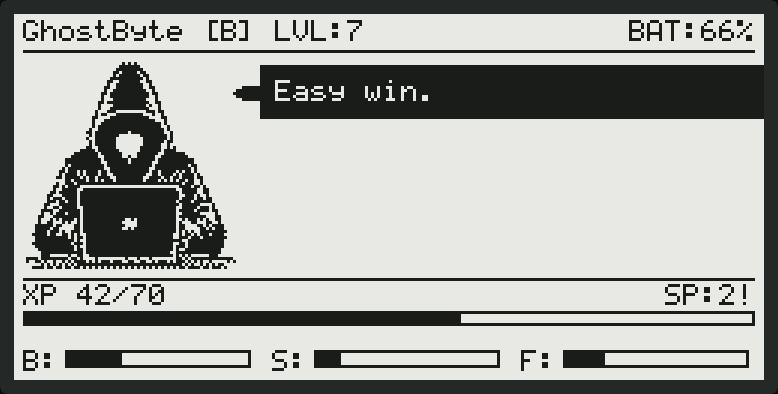</td>
<td width="45%">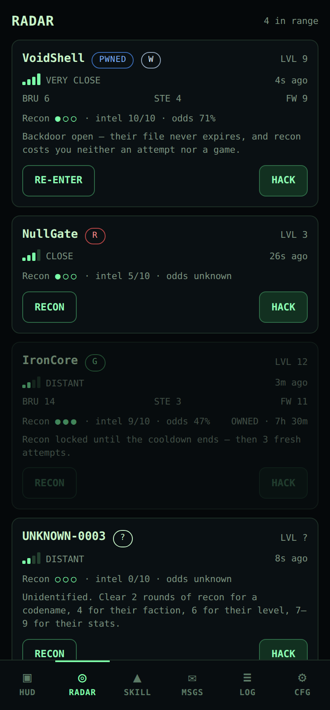</td>
</tr>
<tr>
<td align="center"><sub>The device. Everything it knows, at a glance.</sub></td>
<td align="center"><sub>The portal. Everyone in range, and how much of them you have read.</sub></td>
</tr>
</table>

> Every image in this README is generated from the source, not mocked up. The
> e-ink screens are rendered by running the sketch's own drawing code into a
> framebuffer; the portal screenshots load the same HTML the ESP32 serves.
> `cd test && make shots` rebuilds them all.

---

## Contents

- [Hardware](#hardware) — what you need to buy
- [First-time setup](#first-time-setup) — flash, power, join, play
- [Web portal](#web-portal) — the command interface
- [Factions](#factions) · [Skills](#skills) · [Levelling](#levelling)
- [How hacking works](#how-hacking-works) — recon, intel tiers, the roll
- [Device screens](#device-screens) — every e-ink state
- [LoRa protocol](#lora-protocol) — what actually goes over the air
- [Building and testing](#building-and-testing)

---

## Hardware

| Component | Detail |
|-----------|--------|
| Board | Heltec Wireless Paper V1.2 |
| MCU | ESP32-S3 |
| Display | 250 × 122 px e-ink (landscape) |
| Radio | SX1262 — 868 MHz EU ISM |
| Battery | LiPo via onboard charger |

---

## First-time setup

Flash it. Power it. Pick a side. That's all it takes to enter the network.

### Step 1 — Flash the firmware

**Arduino IDE:**
1. Install the **Heltec ESP32** board package via Boards Manager.
2. Install these libraries via Library Manager:
   - **RadioLib** (version 7.1 or later)
   - **heltec-eink-modules**
3. Open `cypher32.ino`. All headers must be in the same folder.
4. Select board: **Heltec Wireless Paper**.
5. Click **Upload**.

**PlatformIO:**
```
pio run -t upload
```
Dependencies are declared in `platformio.ini` and pulled automatically.

---

### Step 2 — Power on

Connect a LiPo battery or plug in USB. The e-ink display boots, then holds on the **setup screen** — waiting for you to identify yourself.

The device is already broadcasting. An open Wi-Fi network named **`Cypher32`** appears. No password. No ceremony.

---

### Step 3 — Connect

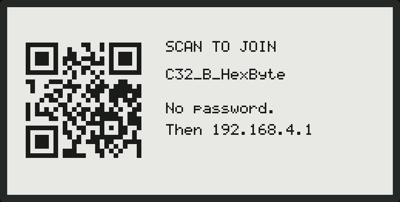

The device shows a **Wi-Fi QR code** on its screen. Point your camera at it and
your phone offers to join — no typing an SSID. (Any time later, HUD → SHOW JOIN
QR ON DEVICE puts it back up for a minute so someone else can scan it.)

Or join **`Cypher32`** manually. The portal should open by itself —
the device runs a captive portal, so your phone's "sign in to network" prompt
lands you straight on it.

If it doesn't, open a browser and go to:

```
192.168.4.1
```
or `cypher32.local`

A three-step setup walks you through what the game is, what each faction does,
and setting a password.

---

### Step 4 — Choose your faction and set a password

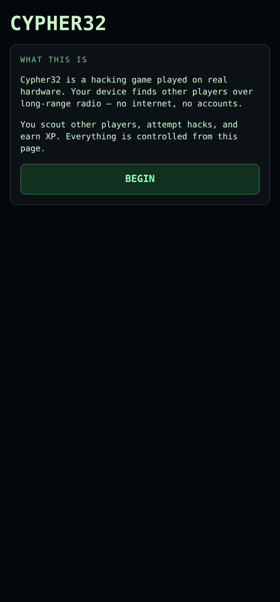

The setup screen asks two things:

1. **Faction** — your allegiance, your combat style, your starting advantage. Not reversible without a full wipe. Choose what fits how you fight (see [Factions](#factions)).
2. **Password** — the device's Wi-Fi is open by design, so anyone nearby can
   reach this page. The password is what stops them spending your skill points
   or wiping your character. Minimum six characters.

Hit **ESTABLISH UPLINK**. The device goes dark for a moment.

---

### Step 5 — You're in

The firmware derives your **hacker name** from your chip ID — deterministic and
permanent, the same name every time this device boots. Crucially it is the
*same* derivation every other device uses, so the name on your screen is the
name your messages arrive under. Nothing about the name is ever transmitted.

There are 576 possible names, so a collision between two devices is unlikely
but not impossible once you have a few dozen in play.

<br clear="all">

The display comes alive:


- Name, faction, and level in the header
- Your character — idle for now, watching
- A speech bubble with something to say
- XP bar and skill indicators along the bottom

Your Wi-Fi SSID has changed to `C32_<Faction>_<Name>`. The portal is readable by
anyone, but every action now needs your password. Your device beacons every
12–18 seconds at first so nearby players find you quickly, settling to 25–35
seconds once you've been discovered.

> **Factory reset:** tap **RST** twice quickly, then hold **PRG** for 5 seconds.
> The screen confirms before it wipes. This needs no password — holding the
> button on the device is the proof you own it, so it is also the way back in
> if you forget one.
>
> Both buttons are involved because RST is wired to the ESP32's reset pin
> rather than a GPIO: software cannot read it, so the double tap is inferred
> from two boots cut short in a row, and PRG confirms.

---

## Web portal

Your command interface. Connect to the device's Wi-Fi and open **192.168.4.1**.

<table>
<tr>
<td>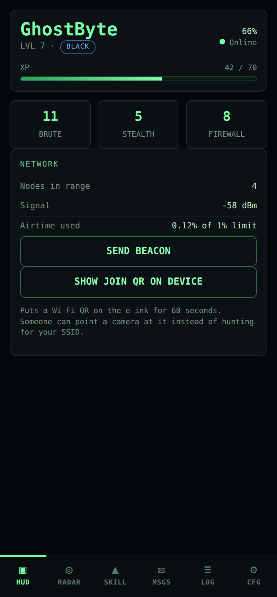</td>
<td>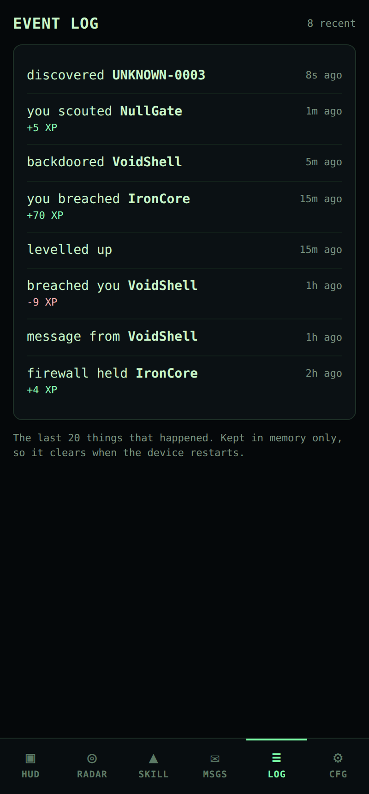</td>
<td>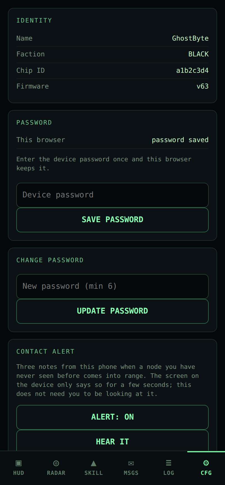</td>
</tr>
<tr>
<td align="center"><sub><b>HUD</b> — who you are, what you have, whether the radio is alive</sub></td>
<td align="center"><sub><b>Log</b> — the last 20 things that happened</sub></td>
<td align="center"><sub><b>Config</b> — contact alert, password, the way out</sub></td>
</tr>
</table>

| Tab | Function |
|-----|----------|
| **HUD** | Level, XP, skills, battery, radio status, manual beacon |
| **Radar** | Everyone in range, sorted by signal — recon and hack from here |
| **Skills** | Spend skill points from level-ups |
| **Msgs** | Send and receive LoRa text — 32 chars max |
| **Log** | The last 20 things that happened, newest first |
| **Config** | Contact alert, password, identity, node list, factory reset, diagnostics |

The page never reloads. It polls the device twice a second, so signal strength,
cooldown countdowns and action status update live.

**Contact alert.** When a node you have never seen before comes into range, the
phone plays three notes — A, C, G, two detuned squares each, through a
resonant filter and a short feedback delay. Synthesised on the page, so there
is no audio file anywhere. The device shows a discovery on its screen for a few
seconds and then goes back to idle, which is no use with the device in a bag;
this is. It needs the page open and the phone awake, and some captive-portal
mini-browsers refuse to play audio at all — open `192.168.4.1` in Chrome or
Safari if you hear nothing. Off switch and a test button are in **Config**.

**Every action tells you what happened.** Press HACK and you get
`SENDING… → WAITING FOR REPLY (2/4) → SUCCESS`, or `NO RESPONSE — out of range?`
if the target never answered. Nothing fails silently.

---

## Factions

Four factions. Each one plays differently. Pick the one that matches your instinct — you can't change it without losing everything.

| Faction | Bonus | Perk | Risk |
|---------|-------|------|------|
| **BLACK** | +3 Brute Force | +20% XP on every successful hack | Full 15 XP loss on fail — no mitigation |
| **WHITE** | +3 Firewall | Fail penalty halved; attacks restricted to BLACK and RED | Limited target pool |
| **RED** | +3 Stealth | +25% XP against GREEN targets | 15% chance of XP loss even on a win |
| **GREEN** | +1 all skills | +10% XP against BLACK targets | 25% XP-loss risk when attacking WHITE |

**BLACK** hits hard and pays for every failure in full.  
**WHITE** plays a defensive game and picks its fights carefully.  
**RED** is a gambler — even victories carry risk.  
**GREEN** starts balanced but earns less unless it exploits its matchups.

---

## Skills

One **Skill Point** per level-up. Spend it in the **Skills** tab. At high levels every point shifts the math.

| Skill | Effect |
|-------|--------|
| **Brute Force** | +2% hit chance per point over the target's Firewall |
| **Stealth** | +1% hit chance per point — and Firewall can't cancel it |
| **Firewall** | Cuts XP lost when your hack fails (floor 5), and blunts Brute Force aimed at you |

Cap: **35** per skill (3 from faction + 32 earned through levels).

---

## Levelling

Every successful hack earns XP. Enough and you level up. The climb gets steeper the higher you go.

- **Max level:** 32
- **XP to clear a level:** `currentLevel × 10` — 10 at LVL 1, 100 at LVL 10,
  310 at LVL 31. Each level costs more than the last.
- **XP per hack:** `15 + target's Firewall × 5` — tougher targets pay more
- XP floor is 0. At LVL 32, surplus XP is discarded.

Reaching LVL 32 takes 4,960 XP, roughly 165 winning hacks. Early levels go
quickly — one good hack can carry you through two or three at the start — and
the climb lengthens steadily from there.

---

## How hacking works

This is what it's all for.

**1. Find a target.**  
Contacts appear in the **Radar** tab when their beacon reaches you, sorted by
signal strength with a plain-language range — VERY CLOSE, CLOSE, DISTANT,
FADING. That is *all* you get. No name, no faction, no level. An unscouted
contact is a signal, not a person.

**2. Run recon.**  

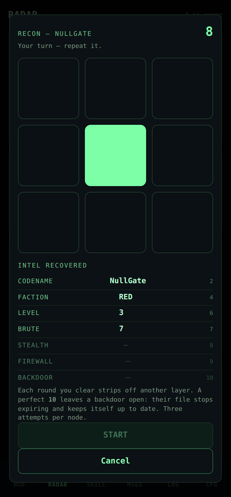

Recon is a **sequence-memory game**, and it is how anybody becomes somebody. A
grid of tiles flashes a pattern; repeat it. Each round adds one step. Every
round you clear strips another layer off the target — and the layer lands the
moment the round does, while you are still playing:

| Round | What comes back |
|-------|-----------------|
| 2 | their **codename** |
| 4 | their **faction** |
| 6 | their **level** |
| 7 | their **Brute Force** |
| 8 | their **Stealth** |
| 9 | their **Firewall** — the Radar stops saying "odds unknown" |
| 10 | a **backdoor** |

<br clear="all">

The furthest round you complete is also your recon score, worth `score × 1.5%`
on your hack odds — a perfect run gives the full **+15%**, putting a level
starting hack at **75%**.

One wrong tile ends the run. Everything you already pulled is yours to keep;
the rest stays dark.

**A perfect 10 leaves a backdoor open.** Their file stops expiring when the
cooldown does, their level and faction keep updating off their beacons on their
own, and walking back in costs you neither an attempt nor another game — one
tap re-pulls the whole dossier. It survives a reboot. It is the only thing in
the game that does.

You get **three attempts per node**, and an attempt is only spent once you
actually pull something: a target that never answers, or a run that dies in the
first round, costs nothing. Spend all three and recon is closed until that
node's cooldown ends — then it resets, three fresh attempts, and the file goes
back to a signal with no name on it. Unless you left a backdoor.

Two things identify someone for free, because they identified themselves:
**sending you a message**, and **attacking you**. Neither hands out the odds
bonus — that is only ever earned by playing.

**3. Hack.**  
One attempt. One roll — made by *their* device, not yours, so nobody can modify
their firmware to declare themselves the winner. The result appears on both
displays. They find out the moment your request lands, whether or not you tell
them how it went.

**4. Win** — the node is yours and locked for **12 hours**.

**5. Lose** — locked out of that node for **12 hours**. Move on.

Either way the node closes for 12 hours. When that ends, recon resets too: three
fresh attempts and a clean slate on the sequence bonus — and everything you knew
about them goes dark again, unless you took the backdoor.

Both cooldowns survive a reboot and survive the target walking out of range, so
neither can be reset by power-cycling or waiting for them to drop off your radar.

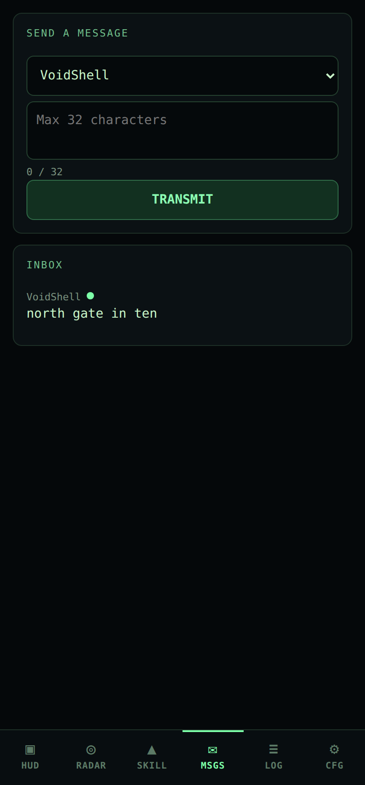

**Talk to them.** 32 characters, straight over the air, no server in between.
Sending someone a message identifies you to them for free — you signed it by
sending it — but it buys them no odds against you. That is the only social
channel in the game, and it is the one people actually use: half of what
happens at a meet-up is negotiated in 32-character bursts.

<br clear="all">

**Hit chance** — one roll, made on the defender's device:
```
base 60%
+ 1.5% per recon sequence step   (max +15% at a perfect 10)
+ 2% per point of Brute Force over their Firewall
+ 1% per point of Stealth       (firewall cannot cancel this)
floor: 25%   ceiling: 90%
```

Brute is contested: it is measured against their Firewall, so it swings hard
both ways and is the stat for cracking hard targets. Stealth is uncontested and
worth half as much per point, but no Firewall can cancel it — the reliable
investment. Recon is the lever you pull per target — and by round 9 it stops
being a bonus and starts being information: their Firewall in hand means the
Radar shows your real odds before you commit instead of "unknown".

No guarantee. Never 100%. RED and GREEN carry their own backfire risks on top,
so their effective win rate is lower than the number shown.

---

## LoRa protocol

Signal only. No names. No location. Nothing beyond what the game requires.

All traffic runs at **868 MHz — SF7 — BW 125 kHz — CR 4/5 — sync 0x12**. Short airtime. Small packets. Devices are never quiet for long.

| Packet | Type | Purpose |
|--------|------|---------|
| `BEACON` | broadcast | Presence pulse — level and faction only |
| `RECON_REQ` | unicast | Open a scouting link on a target |
| `RECON_REPLY` | unicast | Target returns its full file — level, faction, Brute, Stealth, Firewall |
| `HACK_REQ` | unicast | Attack initiated — carries attacker's Brute |
| `HACK_REPLY` | unicast | Defender returns Firewall and faction |
| `HACK_RESULT` | unicast | Outcome and XP delta sent to defender |
| `MSG` | unicast | Raw text, 32 chars |
| `ACK` | unicast | Link-layer acknowledgement |
| `PING` | unicast | Reliable no-op — round-trip probe |

All of it is defined in `cypher32_packets.h`.

Beacons go out every 12–18 seconds while you're discovering, easing to 25–35
seconds once the neighbourhood is known. The interval is jittered — a fixed
cadence lets two devices lock into phase and collide on every single beacon.

Every unicast carries a sequence number and is acknowledged. Unacknowledged
frames are retried up to four times before the portal reports `NO RESPONSE` —
an action never just silently disappears. Duplicates are suppressed, replies are
deferred so they don't collide with the requester re-arming its receiver, and the
radio listens before transmitting.

Every frame also carries a 4-byte HMAC tag keyed on a shared secret.
**Change `LORA_KEY` in `cypher32_packets.h` before you deploy.** It is not real
security — the key is compiled into every device — but it stops someone with a
spare radio injecting packets to award themselves XP.

Airtime is metered against the EU 868 duty cycle limit and diagnostics live at
`192.168.4.1/api/diag`.

---

## Device screens

The e-ink screen only refreshes when something happens — a hack result, an incoming message, a level-up, or a mood shift every 10 minutes. No wasted cycles. No flicker mid-play, and nothing at all drawn while the radio is busy.

- **Header** — name, faction initial, level, battery %
- **Character** — idle / focused / victory / defeat
- **Speech bubble** — quips, scan status, hack outcomes
- **Footer** — XP bar, skill bars (B / S / F)

The character notices when you're losing.

<table>
<tr>
<td>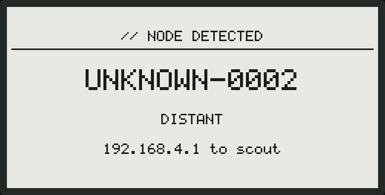</td>
<td>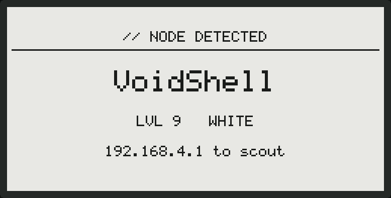</td>
</tr>
<tr>
<td align="center"><sub>Someone arrives. You do not know who yet — that is what recon is for.</sub></td>
<td align="center"><sub>The same screen once you have read them.</sub></td>
</tr>
<tr>
<td>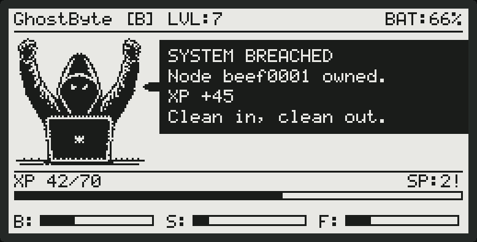</td>
<td>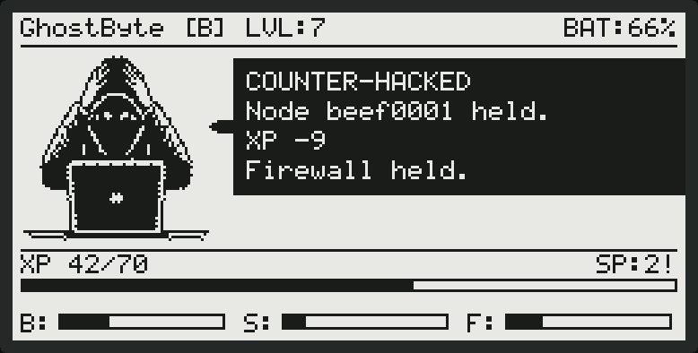</td>
</tr>
<tr>
<td align="center"><sub>You are in.</sub></td>
<td align="center"><sub>You are not. Your character has opinions about it.</sub></td>
</tr>
<tr>
<td>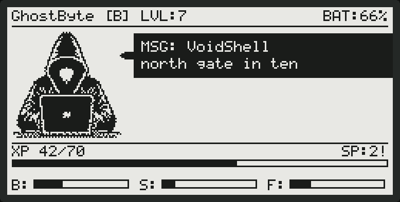</td>
<td>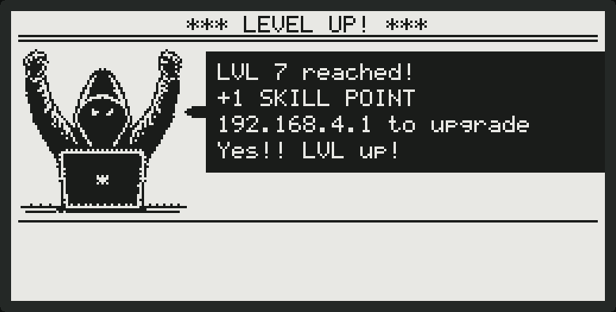</td>
</tr>
<tr>
<td align="center"><sub>32 characters, straight off the air.</sub></td>
<td align="center"><sub>A skill point is waiting in the portal.</sub></td>
</tr>
<tr>
<td>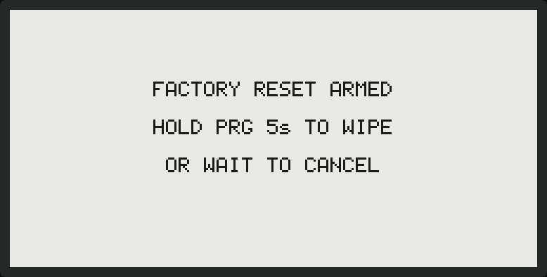</td>
<td>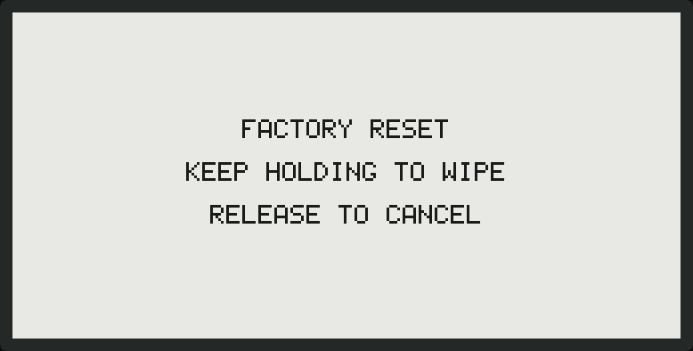</td>
</tr>
<tr>
<td align="center"><sub>Two taps of RST. Nothing has happened yet.</sub></td>
<td align="center"><sub>Let go and it stops. Keep holding and it does not.</sub></td>
</tr>
</table>

---

## Building and testing

### File structure

| File | Purpose |
|------|---------|
| `cypher32.ino` | Main sketch — game logic, display, portal API |
| `cypher32_packets.h` | Packet types, `KnownNode`, node helpers, shared key |
| `cypher32_lora.h` | LoRa stack — link layer, retries, presence, diagnostics |
| `cypher32_crypto.h` | SHA-256 / HMAC-SHA256 for frame signing |
| `cypher32_portal.h` | The web portal, one HTML/CSS/JS blob in PROGMEM |
| `cypher32_qr.h` | Minimal QR encoder for the Wi-Fi join code |
| `platformio.ini` | PlatformIO build config |
| `ROADMAP.md` | Development plan and current status |
| `test/` | Everything below |
| `docs/img/` | Generated — see `make shots` |

### Tests

```
cd test && make          # everything
cd test && make asan     # the C++ suites under AddressSanitizer + UBSan
cd test && make shots    # regenerate every image in docs/img
```

| Stage | What it does |
|-------|--------------|
| `lint` | Every ALL-CAPS constant in the sketch resolves to a `#define` |
| `sketch` | **Compiles `cypher32.ino`** against host stubs in `test/stub/` |
| `run` | Link layer (169 checks) and a two-node radio simulation over a lossy channel (31) |
| `portal` | The real portal HTML against a DOM shim — render, the mini-game, the alert |
| `qr` | The encoder against `python-qrcode`, then the result decoded by OpenCV |

Two of those are worth spelling out, because there is **no ESP32 toolchain in
this repository** and nothing else covers what they cover:

**`make sketch` builds the firmware.** `test/render_eink.cpp` includes
`cypher32.ino` and links it against stubs for the display, Wi-Fi, NVS, the web
server and the radio. It will not catch a bad pin mapping or a linker script
problem, but it catches every typo, every changed signature and every missing
declaration before the Arduino IDE does.

**The e-ink screens are rendered, not photographed.** The same program runs the
sketch's own `displayIdle()`, `displayNewNode()` and friends into a 250×122
framebuffer and dumps it. That is where the images in this README come from,
and it is why they cannot drift from the code. It also means the join QR can be
scanned off the panel as the panel would actually draw it — three pixels per
module, beside two lines of text — which `test_qr_panel.py` does on every run.

The portal screenshots come from `test/shoot_portal.js`, which loads the same
HTML blob the device serves into headless Chromium and answers its API calls.
It needs Chromium and Pillow, so it is not part of `make`.

None of this substitutes for the bench test and field protocol in
`ROADMAP.md` — it exercises logic and pixels, not radios.

---

## License

MIT
